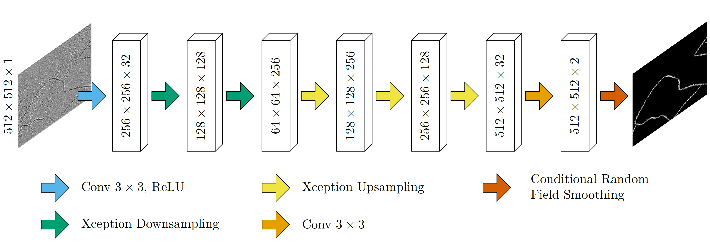

# Mapping drainage ditches in forested landscapes using deep learning and aerial laser scanning
This project aims to map small ditches from high resolution LiDAR data using deep learning

Increasing understanding of environmental risks associated with forest ditches makes
mapping these ditches a priority for sustainable management. Here, we present the
first rigorous deep learning-based methodology to map forest ditches at regional scale.
A deep neural network was trained on high-density aerial laser scanning (ALS) data
and 1607 km of manually mapped ditch channels spread across Sweden. The model
proved to be accurate when evaluated on other heavily ditched countries in the Baltic
Sea Region. Further, these results provides a significant contribution to the
assessment of regional hydrology and ecosystem dynamics in forested landscapes.

paper: Link
Authors: William Lidberg, Siddhartho Shekhar Paul, Florian Westphal, Kai Florian Richter, Niklas Lavesson, Raitis Melniks, Janis Ivanovs, Mariusz Ciesielski, Antti Leinonen, Anneli M. Ågren 

Training dataset  
The 10 digitized regions are dominated by forest and the regions were selected to achieve a broad representation of different landscape properties concerning topography, soil conditions, runoff, land-use and tree species. The ALS point clouds have a density of 1-2 points m-2 and were divided into 55 tiles with the size of 2.5 x 2.5 km each and covering a total of 344 km2. DEMs with 0.5 m resolution were created from the ALS point clouds using a tin gridding approach implemented in Whitebox tools 1.4.0 (Lindsay, 2018). A high pass median filter (HPMF) was applied to the DEMs to emphasize short-range variability in the topography. The HPMF-algorithm was implemented in Whitebox tools (Lindsay, 2018) and operated by subtracting the value at the grid cell at the center of the window from the median value in the surrounding neighborhood with a kernel of 11 cells. Negative values indicate depressions while positive values indicate ridges.

Labels
Ditches were manually digitized as vector lines based on a multidirectional hillshaded DEM and a HPMF. This made it easy to separate local ridges from local depressions (e.g. ditch channels). 20 % of the 55 tiles (n=11) were randomly selected for model testing and were not used to train the model (Figure 1B). The digitized vector lines have no width so we utilized average ditch width from a field inventory where 2188 ditch channels were inventoried in the field (from a national inventory of Swedish landscapes). The average ditch width was 2 m with a standard deviation of 1.3 m. Instead of flagging all pixels within 3 m of a vector line as ditch, we utilized the HPMF to create more natural ditch labels. Pixels within three meters of a vector line and with a HPMF value less than -0.075 were flagged as ditch pixels. The threshold value of -0.075 was selected based on visual observations of ditch channels during the digitalization of the ditches.  Spurious pixels that were not connected to a ditch were removed using a majority filter with a 3 cell kernel (SI1). In total 1607 km of ditch channels were mapped in this manner (“Mendeley Data,” n.d.). 

Deep learning model
The HPMF and labeled data were split into pairs of image chips with 512 x 512 pixels in each chip (Figure 1C). Image chips where ditches made up less than 0.1 % of all pixels in the chip were removed to combat the highly imbalanced class distribution—clearly, most pixels in the data are non-ditch. We used TensorFlow 2.6 to build an encoder-decoder style deep neural network to transform the filtered DEM images into images highlighting the detected ditches. On the encoding path, we applied Xception blocks with residual connections (Chollet, 2017), as shown in Figure 2. The up-sampling path then consists of transposed convolutions and residual connections and outputs the final classification map, which contains, for every pixel in the input image, the probability that the pixel belongs to a ditch. The produced classification map is smoothed using the conditional random field layer proposed by (Zheng et al., 2015). This neural network model is trained using weighted cross-entropy loss to deal with the large class imbalance between ditch and non-ditch pixels (SI2).

The model correctly predicted 99 % of all pixels in the test data and achieved an MCC and kappa of 0.78. Visual inspections of false positive classifications indicated that the model interpreted most channels in the landscape as ditch channels and failed to separate natural stream channels from drainage ditches.

Mapping drainage ditches is an important first step to find effective landscape and hydrology management strategies. We showed that semantic image segmentation with deep learning from high-resolution ALS data can be used to detect previously unmapped drainage ditches in forested landscapes in the Baltic Sea Region with an overall accuracy of 99 % and a MCC 0.78. This novel technique only requires one topographical index, which makes it possible to implement on large scales with limited computational resources. Our method performs at least equally well, and in fact better on most of the metrics than previous ditch detection studies, despite a more varied and challenging landscape dominated by forests. Visual inspection indicated that this method also classifies natural stream channels as ditches which suggests that a deep neural network can be trained to detect natural stream channels in addition to drainage ditches. 

