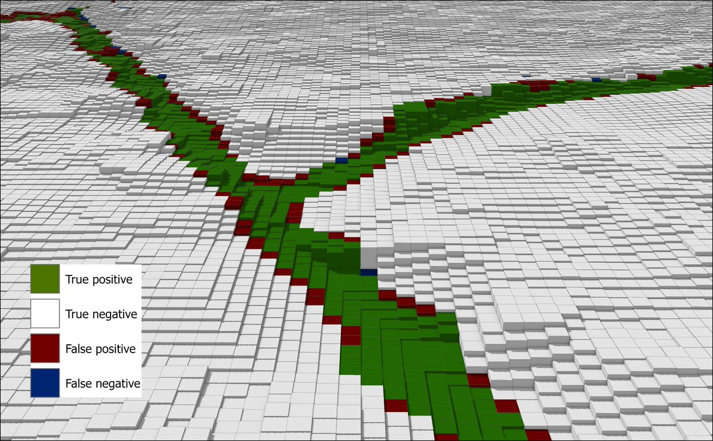

# Mapping drainage ditches in forested landscapes using deep learning and aerial laser scanning
This project aims to map small ditches from high resolution LiDAR data using deep learning

A deep neural network was trained on airborne laser scanning data and 1607 km of manually digitized ditch channels from 10 regions spread across Sweden. The model correctly mapped 82 % of all ditch channels in the test data with a Matthew's correlation coefficient of 0.72. Visual inspection indicates that this method often also classifies natural stream channels as ditches, suggesting that deep neural networks can be trained to detect such channels in addition to drainage ditches. This technique only requires one topographical index, which made it possible to implement on national scale. The model was applied to Sweden and the resulting ditch map is avalaible from the swedish forest agancy: https://www.skogsstyrelsen.se/sjalvservice/karttjanster/geodatatjanster/ftp/

Use this docker image for training and inference: https://hub.docker.com/repository/docker/williamlidberg/ditchnet

Use this Web App to test the model on your own data: https://ditchnet.phloem.se/

## Training dataset  
The 10 digitized regions were dominated by forest and were selected to achieve a broad representation of different landscape properties concerning topography, soil conditions, runoff, land-use and tree species. A compact laser-based system (Leica ALS80-HP-8236) was used to collect the ALS data from an aircraft flying at 2888 -3000 m. The ALS point clouds had a last and only return density of 1-2 points sqm and were divided into 55 tiles with a size of 2.5 x 2.5 km each. Combined, the tiles cover an area of 344 km2. DEMs with 1 m resolution were created from the ALS point clouds using a tin gridding approach implemented in Whitebox tools 1.4.0 (Lindsay, 2018). A high pass median filter (HPMF) was applied to the DEMs to emphasize short-range variability in the topography. The HPMF-algorithm was implemented in Whitebox tools (Lindsay, 2018) and operates by subtracting the value at the grid cell at the center of the window from the median value in the surrounding neighborhood with a kernel of 5 cells. Negative values indicate depressions while positive values indicate ridges.

## Labels
Ditches were manually digitized as vector lines by trained experts that were calibrated amongst themselves with regular meetings and discussions of edge cases. Multidirectional hillshaded DEMs and a HPMF were used to visually separate local ridges from local depressions (e.g. ditch channels). Current and historical orthophotos and maps were used to corroborate “edge cases” to digitize the ditch network. 20 % of data were randomly selected for model testing and were not used to train the model (Figure 1B). The digitized vector lines have no width so we utilized average ditch width from a field inventory where 2188 ditch channels were visited across Sweden (Ståhl et al., 2011). The average ditch width was 2 m with a standard deviation of 1.3 m. Instead of flagging all pixels within ~3 m of a vector line as ditch, we utilized the HPMF to create more natural ditch labels. Pixels within three meters of a vector line and with a HPMF value less than -0.075 were flagged as ditch pixels. The threshold value of -0.075 was selected based on visual observations of ditch channels during the digitalization of the ditches. Spurious pixels that were not connected to a ditch were removed using a majority filter with a 3 cell kernel. In total 1607 km of ditch channels were mapped in this manner (Ågren et al., 2021). 

## Deep learning model
The HPMF and labeled data from each of the 55 tiles were split into pairs of image chips with 512 x 512 pixels in each chip (Figure 1C). Image chips where ditches made up less than 0.1 % of all pixels in the chip were removed to combat the highly imbalanced class distribution—clearly, most pixels in the data are non-ditch. This resulted in 688 pairs of image chips. We used TensorFlow 2.6 to build an encoder-decoder style deep neural network, shown in Figure 2, to transform the filtered HPMF images into images highlighting the detected ditches. On the encoding path, the network learns a series of filters, organized in layers, which express larger and larger neighborhoods of pixels in fewer and fewer vectors of features. This downsampling forces the network to ignore noise and extract features relevant for ditch detection. In contrast to normal convolutional neural networks, which apply a filter to all feature vectors in a certain spatial neighborhood at once, we use Xception blocks (Chollet, 2017). These blocks decouple the filtering of the spatial neighborhood within each feature dimension from the filtering across feature dimensions. This simplifies the learning problem for ditch detection since there is no strong coupling between the two dimensions. 

After encoding the HPMF image into a spatially more compact representation, it is again decoded by a series of learned filters performing transposed convolutions into the final classification map. This map contains, for every pixel in the input image, the probability that the pixel belongs to a ditch. While the neural network considers the neighborhood of the pixel to label that pixel, the procedure still leads to label discontinuities, either in form of ditches disrupted by mislabeled non-ditch pixels or in form of areas of non-ditch pixels in which single pixels are labeled as ditch pixels. In order to smooth out this type of noise, we use a conditional random field layer proposed by Zheng et al. (2015), which learns to penalize undue label discontinuities. This neural network model is trained using weighted cross-entropy loss to deal with the large class imbalance between ditch and non-ditch pixels.

## Results and discussion
Mapping drainage ditches is an important first step in finding effective landscape and hydrology management strategies. We showed that semantic image segmentation with deep learning from high-resolution ALS data can be used to detect previously unmapped drainage ditches in forested landscapes in the Baltic Sea Region with a recall of 84 % and an MCC of 0.72. This novel technique only requires one topographical index, which makes it possible to implement on large scales with limited computational resources. Our method performs better on most of the metrics than previous ditch detection studies – and at least equally well on all others, despite a more varied and challenging landscape in our test data is dominated by forests. Visual inspection indicated that this method also 

## Contributing
"If you'd like to contribute, please fork the repository and use a feature
branch. Pull requests are warmly welcome."

## References
Audet, J., Wallin, M.B., Kyllmar, K., Andersson, S., Bishop, K., 2017. Nitrous oxide emissions from streams in a Swedish agricultural catchment. Agric. Ecosyst. Environ. 236, 295–303. https://doi.org/10.1016/j.agee.2016.12.012

Ayana, E.K., Fisher, J.R.B., Hamel, P., Boucher, T.M., 2017. Identification of ditches and furrows using remote sensing: application to sediment modelling in the Tana watershed, Kenya. Int. J. Remote Sens. 38, 4611–4630. https://doi.org/10.1080/01431161.2017.1327125

Bailly, J.S., Lagacherie, P., Millier, C., Puech, C., Kosuth, P., 2008. Agrarian landscapes linear features detection from LiDAR: Application to artificial drainage networks. Int. J. Remote Sens. 29, 3489–3508. https://doi.org/10.1080/01431160701469057

Bailly, J.S., Levavasseur, F., Lagacherie, P., 2011. A spatial stochastic algorithm to reconstruct artificial drainage networks from incomplete network delineations. Int. J. Appl. Earth Obs. Geoinf. 13, 853–862. https://doi.org/10.1016/j.jag.2011.06.001

Balado, J., Martínez-Sánchez, J., Arias, P., Novo, A., 2019. Road environment semantic segmentation with deep learning from mls point cloud data. Sensors (Switzerland) 19. https://doi.org/10.3390/s19163466

Benstead, J.P., Leigh, D.S., 2012. An expanded role for river networks. Nat. Geosci. https://doi.org/10.1038/ngeo1593

Bhattacharjee, J., Marttila, H., Haghighi, A.T., Saarimaa, M., Tolvanen, A., Lepistö, A., Futter, M.N., Kløve, B., 2021. Development of Aerial Photos and LIDAR Data Approaches to Map Spatial and Temporal Evolution of Ditch Networks in Peat-Dominated Catchments. J. Irrig. Drain. Eng. 147, 04021006. https://doi.org/10.1061/(asce)ir.1943-4774.0001547

Bishop, K., Buffam, I., Erlandsson, M., Fölster, J., Laudon, H., Seibert, J., Temnerud, J., 2008. Aqua Incognita: The unknown headwaters. Hydrol. Process. https://doi.org/10.1002/hyp.7049

Broersen, T., Peters, R., Ledoux, H., 2017. Automatic identification of watercourses in flat and engineered landscapes by computing the skeleton of a LiDAR point cloud. Comput. Geosci. 106, 171–180. https://doi.org/10.1016/j.cageo.2017.06.003

Cazorzi, F., Fontana, G.D., Luca, A. De, Sofia, G., Tarolli, P., 2013. Drainage network detection and assessment of network storage capacity in agrarian landscape. Hydrol. Process. 27, 541–553. https://doi.org/10.1002/hyp.9224

Chollet, F., 2017. Xception: Deep Learning with Depthwise Separable Convolutions.
Elmore, A.J., Julian, J.P., Guinn, S.M., Fitzpatrick, M.C., 2013. Potential Stream Density in Mid-Atlantic U.S. Watersheds. PLoS One. https://doi.org/10.1371/journal.pone.0074819

Garcia-Garcia, A., Orts-Escolano, S., Oprea, S.O., Villena-Martinez, V., Garcia-Rodriguez, J., 2017. A review on deep learning techniques applied to semantic segmentation. arXiv 1–23.
Graves, J., Mohapatra, R., Flatgard, N., 2020. Drainage ditch berm delineation using lidar data: A case study of Waseca County, Minnesota. Sustain. 12, 1–17. https://doi.org/10.3390/su12229600

Hasselquist, E.M., Lidberg, W., Sponseller, R.A., Ågren, A., Laudon, H., 2018. Identifying and assessing the potential hydrological function of past artificial forest drainage. Ambio 47, 546–556. https://doi.org/10.1007/s13280-017-0984-9

Holden, J., Chapman, P.J., Labadz, J.C., 2004. Artificial drainage of peatlands: Hydrological and hydrochemical process and wetland restoration. Prog. Phys. Geogr. 28, 95–123. https://doi.org/10.1191/0309133304pp403ra

Jensen, C.K., McGuire, K.J., Prince, P.S., 2017. Headwater stream length dynamics across four physiographic provinces of the Appalachian Highlands. Hydrol. Process. 31, 3350–3363. https://doi.org/10.1002/hyp.11259

Julian, J.P., Elmore, A.J., Guinn, S.M., 2012. Channel head locations in forested watersheds across the mid-Atlantic United States: A physiographic analysis. Geomorphology. https://doi.org/10.1016/j.geomorph.2012.07.029

Kiss, K., Malinen, J., Tokola, T., 2015. Forest road quality control using ALS data. Can. J. For. Res. 45, 1636–1642. https://doi.org/10.1139/cjfr-2015-0067

Koschorreck, M., Downing, A.S., Hejzlar, J., Marcé, R., Laas, A., Arndt, W.G., Keller, P.S., Smolders, A.J.P., van Dijk, G., Kosten, S., 2020. Hidden treasures: Human-made aquatic ecosystems harbour unexplored opportunities. Ambio 49, 531–540. https://doi.org/10.1007/s13280-019-01199-6

Kuglerová, L., Jyväsjärvi, J., Ruffing, C., Muotka, T., Jonsson, A., Andersson, E., Richardson, J.S., 2020. Cutting Edge: A Comparison of Contemporary Practices of Riparian Buffer Retention Around Small Streams in Canada, Finland, and Sweden. Water Resour. Res. 56, e2019WR026381. https://doi.org/10.1029/2019WR026381

Larson, J., Trivedi, M., 2011. Lidar based off-road negative obstacle detection and analysis. IEEE Conf. Intell. Transp. Syst. Proceedings, ITSC 192–197. https://doi.org/10.1109/ITSC.2011.6083105

Laurén, A., Palviainen, M., Launiainen, S., Leppä, K., Stenberg, L., Urzainki, I., Nieminen, M., Laiho, R., Hökkä, H., 2021. Drainage and stand growth response in peatland forests—description, testing, and application of mechanistic peatland simulator susi. Forests 12, 1–23. https://doi.org/10.3390/f12030293

Lepistö, A., Räike, A., Sallantaus, T., Finér, L., 2021. Increases in organic carbon and nitrogen concentrations in boreal forested catchments — Changes driven by climate and deposition. Sci. Total Environ. 780, 146627. https://doi.org/10.1016/j.scitotenv.2021.146627

Lidberg, W., Paul, S. S., Westphal, F., Richter, K., Lavesson, N., Melniks, R., Ivanovs, J., Ciesielski, M., Leinonen, A., & Ågren, A. (2021). Mapping-drainage-ditches-in-forested-landscapes-using-deep-learning-and-aerial-laser-scanning (Version 1.0.0) [Computer software]. https://doi.org/10.5281/zenodo.1234

Lidberg, W., Nilsson, M., Lundmark, T., Ågren, A.M., 2017. Evaluating preprocessing methods of digital elevation models for hydrological modelling. Hydrol. Process. https://doi.org/10.1002/hyp.11385

Lidman, F., Boily, Å., Laudon, H., Köhler, S.J., 2017. From soil water to surface water-how the riparian zone controls element transport from a boreal forest to a stream. Biogeosciences 14, 3001–3014. https://doi.org/10.5194/bg-14-3001-2017

Lindsay, J.B., 2018. WhiteboxTools User Manual. Guelph. https://doi.org/10.13140/RG.2.2.22964.96648
Lõhmus, A., Remm, L., Rannap, R., 2015. Just a Ditch in Forest? Reconsidering Draining in the Context of Sustainable Forest Management. Bioscience 65, 1066–1076. https://doi.org/10.1093/biosci/biv136

McCabe, M.F., Aragon, B., Houborg, R., Mascaro, J., 2017. CubeSats in Hydrology: Ultrahigh-Resolution Insights Into Vegetation Dynamics and Terrestrial Evaporation. Water Resour. Res. https://doi.org/10.1002/2017WR022240

Nieminen, M., Palviainen, M., Sarkkola, S., Laurén, A., Marttila, H., Finér, L., 2018. A synthesis of the impacts of ditch network maintenance on the quantity and quality of runoff from drained boreal peatland forests. Ambio. https://doi.org/10.1007/s13280-017-0966-y

Passalacqua, P., Belmont, P., Foufoula-Georgiou, E., 2012. Automatic geomorphic feature extraction from lidar in flat and engineered landscapes. Water Resour. Res. 48, 1–18. https://doi.org/10.1029/2011WR010958

Peacock, M., Audet, J., Bastviken, D., Cook, S., Evans, D., Grinham, A., Holgerson, M.A., Högbom, L., Pickard, A.E.,  Zieliński, P., Futter, M.N. 2021. Small artificial waterbodies are widespread and persistent emitters of methane and carbon dioxide. Glob Change Biol. 2021;00:1–15. DOI: 10.1111/gcb.15762

Peacock, M., Gauci, V., Baird, A.J., Burden, A., Chapman, P.J., Cumming, A., Evans, J.G., Grayson, R.P., Holden, J., Kaduk, J., Morrison, R., Page, S., Pan, G., Ridley, L.M., Williamson, J., Worrall, F., Evans, C.D., 2019. The full carbon balance of a rewetted cropland fen and a conservation-managed fen. Agric. Ecosyst. Environ. 269, 1–12. https://doi.org/10.1016/j.agee.2018.09.020

Qian, T., Shen, D., Xi, C., Chen, J., Wang, J., 2018. Extracting farmland features from LiDAR-derived DEM for improving flood plain delineation. Water (Switzerland) 10. https://doi.org/10.3390/w10030252

Rapinel, S., Hubert-Moy, L., Clément, B., Nabucet, J., Cudennec, C., 2015. Ditch network extraction and hydrogeomorphological characterization using LiDAR-derived DTM in wetlands. Hydrol. Res. 46, 276–290. https://doi.org/10.2166/nh.2013.121

Rapinel, Sébastien, Hubert-Moya, L., Clémentb’, B., 2015. Combined use of lidar data and multispectral earth observation imagery for wetland habitat mapping. Int. J. Appl. Earth Obs. Geoinf. https://doi.org/10.1016/j.jag.2014.09.002

Roelens, J., Höfle, B., Dondeyne, S., Van Orshoven, J., Diels, J., 2018a. Drainage ditch extraction from airborne LiDAR point clouds. ISPRS J. Photogramm. Remote Sens. 146, 409–420. https://doi.org/10.1016/j.isprsjprs.2018.10.014

Roelens, J., Rosier, I., Dondeyne, S., Van Orshoven, J., Diels, J., 2018b. Extracting drainage networks and their connectivity using LiDAR data. Hydrol. Process. 32, 1026–1037. https://doi.org/10.1002/hyp.11472

Roulet, N.T., Moore, T.R., 1995. The effect of forestry drainage practices on the emission of methane from northern peatlands. Can. J. For. Res. 25, 491–499. https://doi.org/10.1139/x95-055

Russell, P.P., Gale, S.M., Muñoz, B., Dorney, J.R., Rubino, M.J., 2015. A spatially explicit model for mapping headwater streams. J. Am. Water Resour. Assoc. https://doi.org/10.1111/jawr.12250

Shen, C., Laloy, E., Elshorbagy, A., Albert, A., Bales, J., Chang, F.J., Ganguly, S., Hsu, K.L., Kifer, D., Fang, Z., Fang, K., Li, D., Li, X., Tsai, W.P., 2018. HESS Opinions: Incubating deep-learning-powered hydrologic science advances as a community. Hydrol. Earth Syst. Sci. 22, 5639–5656. https://doi.org/10.5194/hess-22-5639-2018

Sikström, U., Hökkä, H., 2016. Interactions between soil water conditions and forest stands in boreal forests with implications for ditch network maintenance. Silva Fenn. 50. https://doi.org/10.14214/sf.1416

Sit, M., Demiray, B.Z., Xiang, Z., Ewing, G.J., Sermet, Y., Demir, I., 2020. A comprehensive review of deep learning applications in hydrology and water resources. Water Sci. Technol. 82, 2635–2670. https://doi.org/10.2166/wst.2020.369

Stanislawski, L., Brockmeyer, T., Shavers, E., 2018. Automated road breaching to enhance extraction of natural drainage networks from elevation models through deep learning. Int. Arch. Photogramm. Remote Sens. Spat. Inf. Sci. - ISPRS Arch. 42, 671–678. https://doi.org/10.5194/isprs-archives-XLII-4-597-2018

Ståhl, G., Allard, A., Essen, P.A., Glimskär, A., Ringvall, A., Svensson, J., Sundquist, S., Christensen, P., Torell, Å.G., Högström, M., Lagerqvist, K., Marklund, L., Nilsson, B., Inghe, O. 2011. National Inventory of Landscapes in Sweden (NILS) – Scope, design, and experiences from establishing a multiscale biodiversity monitoring system. Environ Monit Assess. 173, 579-595. https://doi.org/10.1007/s10661-010-1406-7

Zheng, S., Jayasumana, S., Romera-Paredes, B., Vineet, V., Su, Z., Du, D., Huang, C., Torr, P.H.S., 2015. Conditional Random Fields as Recurrent Neural Networks.
Ågren, A.M., Paul, Shekhar, S., Lidberg, W. (2021), “Mapped drainage ditches in forested landscapes”, Mendeley Data: https://data.mendeley.com/datasets/zxkg43jsx8/draft?a=626084b8-5664-425a-80a7-8f143370fb62, V1, doi reserved but not active: 10.17632/zxkg43jsx8.1

## Licensing

One really important part: Give your project a proper license. Here you should
state what the license is and how to find the text version of the license.
Something like:

"The code in this project is licensed under MIT license."
